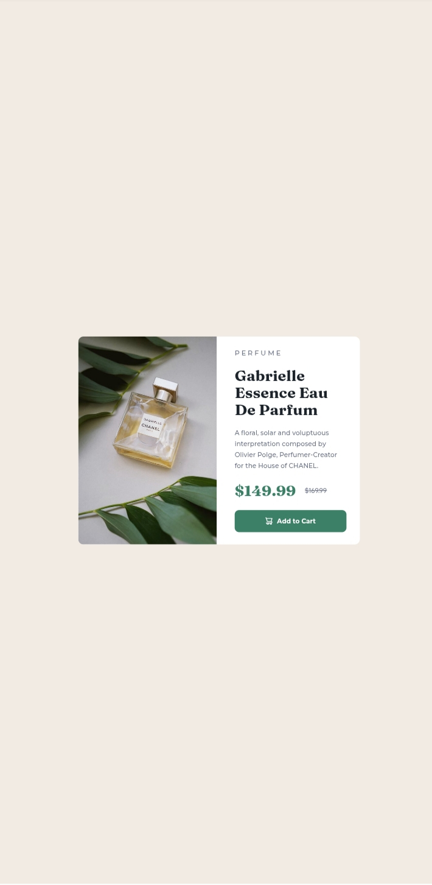

# Frontend Mentor - Product preview card component solution

This is a solution to the [Product preview card component challenge on Frontend Mentor](https://www.frontendmentor.io/challenges/product-preview-card-component-GO7UmttRfa). Frontend Mentor challenges help you improve your coding skills by building realistic projects. 

## Table of contents

- [Overview](#overview)
  - [Screenshot](#screenshot)
  - [Links](#links)
- [My process](#my-process)
  - [Built with](#built-with)
  - [What I learned](#what-i-learned)
  - [Continued development](#continued-development)
- [Author](#author)

**Note: Delete this note and update the table of contents based on what sections you keep.**

## Overview
  A practice frontend mentor project of a QRcode design
  Testing CSS
### Screenshot

### Links

- Solution URL:(https://github.com/triplekdev/Product_preview_card_component_practice)
- Live Site URL:(https://product-preview-card-component-prac.vercel.app/)

## My process

### Built with

- Semantic HTML5 markup
- CSS custom properties
- Flexbox
- Mobile-first workflow

### What I learned

I learnt better use of css variables, and use of comments, use of layers and understanding the css cascade

To see how you can add code snippets, see below:

### Continued development

I'm going to continue developing my css organisation 

## Author

- Github - [Triple K](https://github.com/triplekdev)
- Frontend Mentor - [@triplekdev](https://www.frontendmentor.io/profile/triplekdev)
- Twitter - [@3plkk](https://x.com/3plkk)
